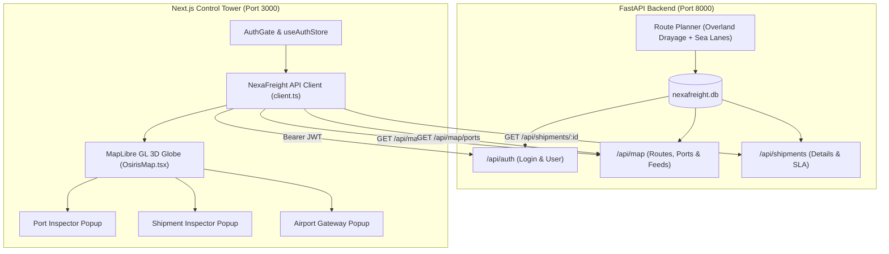

# NexaFreight Control Tower — Phase 1 & 2 Comprehensive Overview

> **Document Type:** Technical Architecture, Implementation Log & Map Visual Legend  
> **Platform:** NexaFreight Global Supply Chain Control Tower (OSIRIS Fork)  
> **Backend:** FastAPI, Python 3.12, SQLite (`nexafreight.db`), SQLAlchemy AsyncSession  
> **Frontend:** Next.js 16 (Turbopack, App Router), TypeScript, MapLibre GL (WebGL 3D Globe), TailwindCSS  

---

## 1. Executive Summary

The **NexaFreight Control Tower** integrates enterprise freight management with an intelligence-grade 3D geospatial globe. Over **Phase 1** and **Phase 2**, we transitioned the system from a standalone OSINT visualization tool into an end-to-end multimodal supply chain command center connected to a real transactional backend.

- **Phase 1 (Authentication, Data Models & Client Integration):** Built the JWT auth pipeline, TypeScript API client, strongly-typed domain schemas, and end-to-end connectivity between Next.js and FastAPI.
- **Phase 2 (Geospatial Mapping, Route Planning & Entity Inspectors):** Implemented multimodal route generation (sea shipping lanes, great-circle air arcs, and dry-land truck drayage), interactive MapLibre GL layers, dynamic port congestion visualization, live entity inspector popups, and rock-solid hydration/session recovery.



---

## 2. Map Legend & Visual Reference Guide

A central part of the system is the **MapLibre 3D Globe**. The table and sections below detail what every line, bubble, marker, and color represents.

### 2.1 Route Lines & Transport Modes

Shipments are broken into sequential legs. Each transport mode is visually distinct:

| Mode | Line Color | Line Styling | Geometry & Behavior | What It Represents |
| :--- | :--- | :--- | :--- | :--- |
| **SEA** | **Dashed Blue** (`#3B82F6`) | `[2, 2]` Dash, 1.8px – 4.5px width | Navigates true ocean shipping straits (e.g. Malacca, Bab-el-Mandeb, Suez, Gibraltar, English Channel, Panama). Does **not** cross landmasses. | Container ships and maritime freight moving between international seaports. |
| **AIR** | **Solid Orange** (`#F97316`) | Solid high-contrast line, 2.0px – 4.8px width | Great-circle geodesic arcs spanning continents directly between dedicated cargo airport gateways (`CDG`, `AMS`, `HAM`, `DXB`, `BOM`). | High-priority air cargo flights carrying express or high-value freight. |
| **ROAD** | **Glowing Emerald Green** (`#00E676`) | Solid line with surrounding 0.25 opacity halo blur | Short-to-medium overland paths connecting seaports to inland logistic hubs and airports strictly across dry land. | Intermodal truck drayage transferring containers to/from inland depots and airport hubs. |
| **RAIL** | **Dashed Purple** (`#A855F7`) | `[4, 2]` Dash pattern, 1.8px – 4.5px width | Overland railway corridors connecting regional cargo hubs. | Freight trains hauling bulk cargo across continental networks. |

---

### 2.2 Bubbles, Markers & Entity Icons

> **Question: "Is all bubble denote port?"**  
> **Answer: No.** The map displays different categories of markers:

```
Map Markers Breakdown:
 ├── Port Bubbles (Dynamic Congestion Colors: Green -> Amber -> Red)
 ├── Airport Hub Badges (Orange Circle + Airplane Icon + IATA Code)
 ├── Road Drayage Trucks (Emerald Circle + Truck Icon + TRK-XXX Label)
 ├── Geopolitical Crisis Zones (Warning Triangles: Red/Orange/Yellow)
 └── Base Intelligence Entities (Subsea Cables & Background AIS Ships)
```

#### A. Port Bubbles (`ports-layer`)
These are circular markers positioned at real-world UN/LOCODE seaport coordinates. Their **color dynamically indicates real-time congestion index**:

| Congestion Multiplier | Bubble Color | Visual Status | Operational Meaning |
| :--- | :--- | :--- | :--- |
| **$0.00\times - 0.89\times$** | **Light Green / Mint** (`#00E676` / `#69F0AE`) | `OPTIMAL FLOW` | Port operating under capacity; vessels berth and turn around with zero delays. |
| **$0.90\times - 1.19\times$** | **Amber / Gold** (`#FFD700`) | `NORMAL ACTIVITY` | Baseline standard operating rhythm. Standard scheduled dwell times. |
| **$1.20\times - 1.49\times$** | **Vibrant Orange** (`#FF9100`) | `ELEVATED DELAYS` | High container dwell times, queueing outside anchorage; risk of SLA slippage. |
| **$\ge 1.50\times$** | **Crimson Red** (`#FF1744`) | `CRITICAL CONGESTION` | Severe bottleneck. Berthing wait exceeds 48+ hours; triggers supply chain alerts. |

#### B. Cargo Airport Hub Badges (`airports-layer`)
- **Symbol:** Circular badge with an orange halo and an **airplane glyph** (✈).
- **Label:** 3-letter IATA Airport Code (e.g. `CDG`, `AMS`, `HAM`, `DXB`, `BOM`).
- **Function:** Dedicated international airfreight gateways where overland road trucks transfer cargo to transcontinental air routes.

#### C. Road Freight Trucks (`routes-trucks-layer`)
- **Symbol:** Glowing neon emerald circle with a **truck icon**.
- **Label:** `TRK-001`, `TRK-002`, etc.
- **Function:** Marks active drayage transport moving along road legs between seaports and inland logistics distribution centers.

#### D. Global Conflict & Crisis Triangles (`conflict-icons`)
- **Symbol:** Triangular warning badge (`!`) placed over conflict areas (e.g., Ukraine, Gaza, Syria, Iraq, Red Sea).
- **Colors:** Red (`#D32F2F`) for active war zones; Orange (`#E65100`) for high geopolitical risk; Yellow (`#F9A825`) for instability.
- **Function:** Warns operators when maritime or air routes pass adjacent to high-risk zones (such as Bab-el-Mandeb / Red Sea drone and missile threats).

---

## 3. What Was Built in Phase 1

### 3.1 Authentication & Operator Access
- **Backend Auth:** Implemented FastAPI JWT authentication (`/api/auth/login` and `/api/auth/me`) using SHA-256 password hashing.
- **Operator Account:** Seeded default control tower credentials:
  - **Email:** `operator@nexafreight.dev`
  - **Password:** `changeme123`
- **In-Memory & Storage Pipeline:** Built `useAuthStore` with client-safe synchronization. Tokens are stored in module memory with automatic fallback to session storage so operator reloads remain authenticated.
- **Next.js Proxy:** Configured `next.config.ts` rewrites to proxy `/api/nexa/*` calls to the FastAPI backend at `http://127.0.0.1:8000/api/*`, eliminating CORS friction.

### 3.2 Types & Client Library
Created a complete TypeScript SDK in `src/lib/nexafreight/`:
- **`types.ts`:** Domain definitions for `Port`, `Leg`, `ShipmentDetail`, `ShipmentListItem`, `RouteFeatureCollection`, `PortFeatureCollection`, and `User`.
- **`client.ts`:** Strongly-typed API client wrapper handling `login()`, `getCurrentUser()`, `getShipments()`, `getShipmentDetail()`, `getPorts()`, and `getAllRoutes()`.
- **`errors.ts`:** Specialized error classes (`NexaHttpError`, `NexaNetworkError`) for precise HTTP status handling.

---

## 4. What Was Built in Phase 2

### 4.1 Realistic Multimodal Route Planning
To avoid unrealistic lines cutting through continents or trucks floating on water, we overhauled `route_planner.py`:
1. **Sea Routing:** Waypoint-based nautical pathfinding that follows international maritime canals and shipping straits.
2. **Air Routing:**
   $$\text{Origin Port} \xrightarrow{\text{Road Drayage}} \text{Origin Airport} \xrightarrow{\text{Air Arc (Geodesic)}} \text{Dest Airport} \xrightarrow{\text{Road Drayage}} \text{Dest Port}$$
3. **Road Drayage:** Connected ports to designated dry-land inland depots (e.g., Newark Distribution Hub, Delta Logistics Park, Hamburg Inland Terminal).
4. **Database Regeneration:** Re-seeded all 600 active shipment route legs with verified `[longitude, latitude]` LineStrings.

### 4.2 Interactive Map Layers in `OsirisMap.tsx`
- **Dynamic Layer Registration:** Configured WebGL sources for `ports`, `airports`, `routes`, and `trucks`.
- **Reactive Data Loader:** Added listeners that populate the map on load and automatically re-fetch routes whenever the operator logs in (`nexafreight:auth_success`).
- **Entity Inspector Popups:**
  - **Port Inspector:** Triggered by clicking any port circle. Displays port name, UN/LOCODE, congestion multiplier, and coordinates.
  - **Shipment Inspector:** Triggered by clicking any route line or truck icon. Calls `getShipmentDetail()` to fetch live SLA deadline, origin/destination hubs, container count, leg count, and order on-time/late statistics.
  - **Airport Gateway Inspector:** Displays hub connectivity and international freight routing status.

### 4.3 Reliability & Bug Fixes
- **Hydration Mismatch Eliminated:** Fixed Next.js SSR mismatch where client-side `localStorage` differed from the initial server render. Added an `isHydrated` guard that renders a matching loader screen on both server and client before mounting.
- **401 Token Invalidation Handling:** When a token expires or is rejected, `apiFetch` purges the invalid token from storage and gracefully redirects the operator to `/login?reason=expired` instead of leaving the application in a zombie state with invisible lines.
- **Retired Legacy OSINT Data:** Completely removed old mock maritime port and supplier click handlers (`maritime-dots`, `scm-dots`) so every map interaction displays exclusively real backend data.
- **Empty State Fallback:** Ensured that if a shipment route is approximate or lacks extended order details, the inspector popup falls back to feature properties without crashing.

---

## 5. Verification & Test Metrics

The codebase is continuously validated across automated test suites:

| Test Suite | Scope | Result | Details |
| :--- | :--- | :--- | :--- |
| **TypeScript Typecheck** | Next.js Frontend | **PASSED (0 Errors)** | `npx tsc --noEmit` clean across all components and pages. |
| **Vitest Frontend Tests** | Next.js Frontend | **PASSED (416/416 Tests)** | 24 test suites covering API clients, storage, geometry math, and controls. |
| **Pytest Route Planner** | FastAPI Backend | **PASSED (9/9 Tests)** | Verifies overland drayage, airport arcs, and canal waypoint integrity. |
| **Pytest Map Integration** | FastAPI Backend | **PASSED (56/56 Tests)** | Validates `/api/map/routes`, `/api/map/ports`, `/api/map/positions/stream`, and auth gates. |

---

## 6. Readiness for Phase 3

With Phase 1 and 2 complete, the application has a rock-solid foundation for **Phase 3 (Live Moving Positions via SSE)**:
- Backend SSE endpoint `/api/map/positions/stream` is implemented with JWT query auth support.
- Simulated position interpolators are active and healthy.
- Next step: Streaming live asset updates (moving vessels, planes, and trucks) in real time onto the MapLibre globe.
