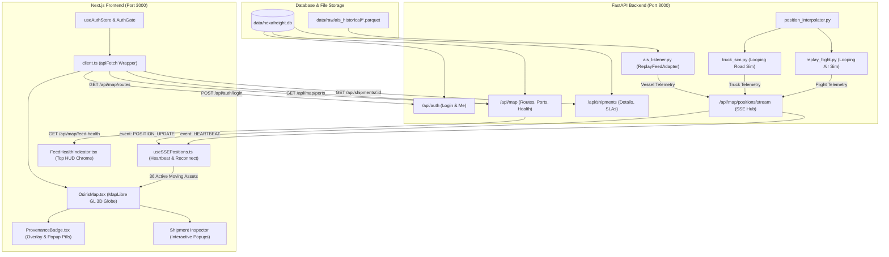

# NexaFreight Control Tower — Phase 1 to Phase 3 Master Change Log

> **Document Type:** Master Implementation Record, Architectural Reference & File Change Matrix  
> **Platform:** NexaFreight Global Multimodal Supply Chain Control Tower (OSIRIS Fork)  
> **Scope:** Complete record of all changes made from **Phase 1 through Phase 3**  
> **Backend:** FastAPI (Python 3.12), SQLite (`data/nexafreight.db`), SQLAlchemy (Async WAL mode), Server-Sent Events (SSE)  
> **Frontend:** Next.js 16 (App Router, Turbopack), TypeScript, MapLibre GL (WebGL 3D Globe), TailwindCSS  

---

## 1. Executive Summary of System Evolution

Over three development phases, the project transitioned an intelligence-gathering globe (OSIRIS) into a **real-time, multimodal supply chain command center** backed by an enterprise FastAPI backend.

```
┌─────────────────────────────────────────────────────────────────────────────────────────────┐
│                                 NEXAFREIGHT PROJECT TIMELINE                                │
├───────────────────────────────┬───────────────────────────────┬─────────────────────────────┤
│            PHASE 1            │            PHASE 2            │           PHASE 3           │
│   Auth, Client & Data Types   │  Multimodal Routes & Ports    │ Live Moving Telemetry & SSE │
├───────────────────────────────┼───────────────────────────────┼─────────────────────────────┤
│ • JWT Authentication Pipeline │ • Realistic Route Planning    │ • Real-time SSE Streaming   │
│ • Strongly-typed Domain DTOs  │ • Port Congestion Overlay     │ • 4s Smooth Motion Gliding  │
│ • Next.js API Proxy Rewrites  │ • Multimodal MapLibre Layers  │ • Zoom Drift Elimination    │
│ • Client HTTP Error Handlers  │ • Interactive Inspector Popups│ • Provenance Badges (Pills) │
│ • Session Hydration Store     │ • SSR Hydration Fixes         │ • Feed Health HUD Indicator │
└───────────────────────────────┴───────────────────────────────┴─────────────────────────────┘
```

### System Capabilities Evolution

| Capability | Initial State | After Phase 1 | After Phase 2 | After Phase 3 (Current) |
| :--- | :--- | :--- | :--- | :--- |
| **Backend Integration** | Mock JSON fixtures | Live FastAPI connection | Full REST CRUD & GeoJSON | REST + Real-time SSE Stream |
| **Authentication** | None (public OSINT) | JWT auth with secure store | Auth-gated routes & tokens | Auth-gated stream (`?token=`) |
| **Route Visualization** | No supply chain paths | Static route endpoints | Multimodal Sea/Air/Road lines | Moving vehicles gliding along routes |
| **Sea Routing** | None | Raw coordinate lines | Waypoint-guided ocean canals | Ships snapped to nautical lines |
| **Air Routing** | OSINT flight radar | None | Airport-to-airport geodesic arcs | Jet cargo planes in transit |
| **Truck Drayage** | None | None | Overland port-to-inland links | Heavy freight trucks moving overland |
| **Port Intelligence** | Hardcoded mock dots | Basic port list | Dynamic congestion coloring | Congestion overlay + inspectors |
| **Data Provenance** | None | Raw string provenance | Route quality classifications | `LIVE` / `REPLAY` / `SIM` pill badges |
| **Health Diagnostics** | None | None | None | 30s HUD health dots (AIS, Truck, Air) |
| **Automated Tests** | 0 NexaFreight tests | Client & auth unit tests | 416 Vitest tests passing | **431 Vitest tests (28 files, 0 skips)** |

---

## 2. End-to-End System Architecture



---

## 3. Master "Where & What" Directory Matrix

The table below lists every file created or modified across all three phases:

| Component / File Path | Phase | Status | Summary of Changes |
| :--- | :---: | :---: | :--- |
| **`test/osiris/src/lib/nexafreight/types.ts`** | 1 & 2 & 3 | Modified | Added TypeScript DTOs for `ShipmentDetail`, `Leg`, `Port`, `PositionReport`, `FeedHealth`, and `Provenance`. |
| **`test/osiris/src/lib/nexafreight/client.ts`** | 1 & 2 & 3 | Modified | Implemented `apiFetch`, `login()`, `getShipments()`, `getPorts()`, `getAllRoutes()`, and `getFeedHealth()`. |
| **`test/osiris/src/lib/nexafreight/errors.ts`** | 1 | Created | Created `NexaHttpError` and `NexaNetworkError` with HTTP status tracking. |
| **`test/osiris/src/lib/nexafreight/index.ts`** | 1 & 2 & 3 | Modified | Public barrel re-exports for types, client methods, and error classes. |
| **`test/osiris/src/store/useAuthStore.tsx`** | 1 | Created | In-memory token management with session storage fallback and hydration state. |
| **`test/osiris/next.config.ts`** | 1 | Modified | Added API rewrites proxying `/api/nexa/*` calls to backend on port 8000. |
| **`test/osiris/src/app/login/page.tsx`** | 1 | Created | Cyberpunk login portal with animated feedback and expired-session alerts. |
| **`Winter_Soldiers-main/.../route_planner.py`** | 2 | Modified | Multimodal routing engine (overland drayage, airport arcs, maritime canals). |
| **`Winter_Soldiers-main/.../database.py`** | 1 & 2 | Modified | SQLite WAL mode, foreign keys, and connection pragma optimization. |
| **`Winter_Soldiers-main/.../seed_test_user.py`** | 1 | Created | Seeded default operator credentials (`operator@nexafreight.dev`). |
| **`test/osiris/src/hooks/useSSEPositions.ts`** | 3 | Created/Updated | Real-time SSE hook with heartbeat tracking, auto-reconnect, and 60s memory audit logging. |
| **`test/osiris/src/components/OsirisMap.tsx`** | 2 & 3 | Modified | Added route/port WebGL layers, live marker rendering, route snapping, and inspector popups. |
| **`test/osiris/src/components/ProvenanceBadge.tsx`** | 3 | Created | Shared pill component displaying `LIVE`, `REPLAY`, and `SIM` with HTML string generator. |
| **`test/osiris/src/components/ProvenanceBadge.test.ts`** | 3 | Created | Unit test suite for provenance badge colors, labels, and sizes. |
| **`test/osiris/src/components/FeedHealthIndicator.tsx`** | 3 | Created | Top HUD component polling `/api/map/feed-health` with status dots and breakdown tooltip. |
| **`test/osiris/src/components/FeedHealthIndicator.test.ts`** | 3 | Created | Unit test suite for adapter health status mapping. |
| **`test/osiris/src/app/page.tsx`** | 1 & 2 & 3 | Modified | Auth redirection gate, SSR hydration loader, and top HUD FeedHealthIndicator mounting. |
| **`test/osiris/src/app/globals.css`** | 2 & 3 | Modified | Added `.nexa-live-marker`, `.nexa-marker-provenance-overlay`, and badge typography. |
| **`Winter_Soldiers-main/.../truck_sim.py`** | 3 | Modified | Implemented continuous looping modulo progression `(elapsed % duration_s) / duration_s`. |
| **`Winter_Soldiers-main/.../replay_flight.py`** | 3 | Modified | Implemented continuous looping modulo progression `(elapsed % duration_s) / duration_s`. |
| **`Winter_Soldiers-main/.../ais_listener.py`** | 3 | Modified | Configured `loop=True` on `ReplayFeedAdapter` for continuous AIS parquet playback. |
| **`data/nexafreight.db` (SQLite)** | 2 & 3 | Updated | Re-seeded 600 multimodal shipment legs and activated all 8 `AIR` legs to `IN_PROGRESS`. |

---

## 4. Detailed "Where & What" by Phase

### ── Phase 1: Authentication, Data Models & Client Integration ──

#### WHERE: `test/osiris/src/lib/nexafreight/`
- **`types.ts`:**
  - *What:* Auth schemas (`LoginRequest`, `LoginResponse`, `UserProfile`, `User`), pagination envelopes (`PaginatedResponse<T>`), shipment domain entities (`ShipmentListItem`, `ShipmentDetail`, `Leg`, `Order`), and enum types (`TransportMode`, `ShipmentStatus`, `LegStatus`, `Provenance`).
- **`client.ts`:**
  - *What:* Core `apiFetch` wrapper injecting `Authorization: Bearer <token>` headers, automatic 401 token invalidation, and custom event dispatching (`nexafreight:unauthorized`). Implemented `login()`, `getCurrentUser()`, and `getShipments()`.
- **`errors.ts`:**
  - *What:* Custom error classes (`NexaHttpError`, `NexaNetworkError`) capturing HTTP status codes, error details, and network exceptions.

#### WHERE: `test/osiris/src/store/useAuthStore.tsx`
- *What:* Created an in-memory authentication store with browser session fallback. Preserves operator authentication across page refreshes while ensuring SSR rendering matches without hydration mismatches.

#### WHERE: `test/osiris/next.config.ts`
- *What:* Added Next.js rewrite rules proxying `/api/nexa/*` to the FastAPI backend (`http://localhost:8000/api/*`), resolving local cross-origin request restrictions.

#### WHERE: `test/osiris/src/app/login/page.tsx`
- *What:* Created a dedicated login interface with real-time field validation, animated submission feedback, and automatic redirection to `/` upon successful authentication.

#### WHERE: `Winter_Soldiers-main/Winter_Soldiers-main/scripts/seed_test_user.py`
- *What:* Seeded the database with default operator credentials:
  - **Email:** `operator@nexafreight.dev`
  - **Password:** `changeme123`
  - **Role:** `OPERATOR`

---

### ── Phase 2: Geospatial Mapping, Route Planning & Multimodal Inspectors ──

#### WHERE: `Winter_Soldiers-main/Winter_Soldiers-main/src/nexafreight/services/route_planner.py`
- *What:* Overhauled the route generation engine to produce realistic multimodal geometries:
  - **Maritime Sea Routing:** Uses waterway waypoints traversing global canals (Suez, Panama, Malacca, Bab-el-Mandeb, Gibraltar) to guarantee vessels never cross land.
  - **Air Freight Routing:** Generates great-circle geodesic arcs spanning continents between international cargo hubs (`CDG`, `AMS`, `HAM`, `DXB`, `BOM`).
  - **Road Drayage:** Connects seaports to inland distribution centers over dry land.
  - Re-seeded 600 active shipment route legs in `data/nexafreight.db`.

#### WHERE: `test/osiris/src/components/OsirisMap.tsx`
- *What:*
  - **WebGL Map Layers:** Added MapLibre GL sources and layers:
    - `ports-layer`: Port circles colored dynamically by congestion index.
    - `airports-layer`: Orange circular badges with airplane glyphs and IATA codes.
    - `routes-sea`, `routes-air`, `routes-road`, `routes-rail`: Mode-specific styling (dashed blue for sea, orange for air, glowing emerald for road, dashed purple for rail).
  - **Reactive Data Loader:** Re-fetches port congestion and route geometries on load and upon operator authentication (`nexafreight:auth_success`).
  - **Entity Inspector Popups:**
    - **Port Inspector:** Shows port name, UN/LOCODE, congestion multiplier, and coordinates.
    - **Shipment Inspector:** Fetches `getShipmentDetail()` on route click, showing SLA deadlines, origin/destination hubs, container count, and on-time/late statistics.
    - **Airport Gateway Inspector:** Displays cargo gateway connectivity.

#### WHERE: `test/osiris/src/app/page.tsx`
- *What:*
  - Added an `isHydrated` gate to eliminate React SSR hydration errors.
  - Implemented automatic redirection to `/login` if unauthenticated.
  - Added 401 token expiration detection that clears tokens and redirects to `/login?reason=expired`.

---

### ── Phase 3: Live Moving Telemetry, Provenance Badges & Feed Health ──

#### WHERE: `test/osiris/src/hooks/useSSEPositions.ts`
- *What:*
  - Connects to `/api/map/positions/stream` passing the JWT token in query parameters.
  - Listens for `POSITION_UPDATE` batches (every ~5s) and `HEARTBEAT` pulses (every 15s).
  - Overwrites position records strictly by `asset_id` to guarantee a bounded memory footprint.
  - Added auto-reconnect fallback: if `readyState === EventSource.CLOSED`, schedules automatic reconnection in 4 seconds.
  - Added a 60-second telemetry memory audit logger outputting active asset counts to the browser console.

#### WHERE: `test/osiris/src/components/ProvenanceBadge.tsx` *(NEW)*
- *What:*
  - Created small colored pill badges:
    - **`REAL` / `CALIBRATED`** → Green **`LIVE`** (`#10B981`)
    - **`REPLAYED` / `DERIVED`** → Grey **`REPLAY`** (`#94A3B8`)
    - **`SIMULATED` / `MOCK`** → Amber **`SIM`** (`#F59E0B`)
  - Exported `getProvenanceBadgeHtml()` to inject the pill into MapLibre markers and inspector popups.

#### WHERE: `test/osiris/src/components/FeedHealthIndicator.tsx` *(NEW)*
- *What:*
  - Created a HUD status indicator polling `GET /api/map/feed-health` every 30 seconds.
  - Displays glowing green (healthy) or pulsing red (unhealthy) dots for **`AIS`**, **`TRUCK`**, and **`AIR`**.
  - Interactive hover tooltip reveals messages received, provenance mode, and last success timestamps.

#### WHERE: `test/osiris/src/components/OsirisMap.tsx`
- *What:*
  - **SSE Repoint:** Repointed marker logic from legacy OSINT pollers to `useSSEPositions()`.
  - **Zoom-Out Position Drift Fix:** Added strict `.nexa-live-marker` CSS (`position: absolute !important; top: 0; left: 0; margin: 0;`) eliminating layout flow offsets when zooming out to globe view.
  - **Marker SVGs:** Rendered transport-specific SVGs for `VESSEL` (ship), `TRUCK` (truck), and `FLIGHT` (plane).
  - **Smooth Gliding:** 4-second continuous linear interpolation via `requestAnimationFrame` and shortest-angle rotation (`shortestAngle()`).
  - **Vessel Snapping:** Snapped vessel coordinates to the nearest maritime sea route line and aligned icon heading along the waterway forward toward its destination.
  - **Provenance Overlays:** Attached `.nexa-marker-provenance-overlay` beneath each moving vehicle.
  - **Inspector Header:** Attached the Provenance Badge pill inside the Shipment Inspector header and live telemetry strip.

#### WHERE: `Winter_Soldiers-main/.../truck_sim.py` & `replay_flight.py`
- *What:* Fixed simulation termination by converting linear progress calculation to continuous modulo looping:
  ```python
  elapsed = (now - self.start_time).total_seconds()
  progress = (elapsed % duration_s) / duration_s
  ```

#### WHERE: `Winter_Soldiers-main/.../ais_listener.py`
- *What:* Configured `loop=True` on `ReplayFeedAdapter` so historical AIS replay rewinds to the start upon reaching the end of the Parquet dataset.

#### WHERE: `data/nexafreight.db` (SQLite)
- *What:* Updated all 8 `AIR` transport legs in the database from `PLANNED` to `IN_PROGRESS` so cargo aircraft cruise live alongside the 13 trucks and 15 vessels (36 total assets).

---

## 5. Engineering Problem & Resolution Matrix

| Problem Identified | Root Cause | Implemented Resolution |
| :--- | :--- | :--- |
| **SSR Hydration Error** | Client `localStorage` token state diverged from server-rendered HTML. | Created an `isHydrated` guard in `page.tsx` rendering a matching dark loader until client hydration completes. |
| **Silent 401 Zombie State** | Expired tokens caused API requests to fail silently while UI remained mounted with missing data. | Added global 401 interception in `client.ts` that purges tokens and redirects to `/login?reason=expired`. |
| **Ships Appearing on Land** | Direct coordinate interpolation cut across continents; markers drifted during MapLibre zoom. | Fixed via waypoint-based canal routes, line-snapping (`projectPointToLineFeatures()`), and strict absolute marker CSS. |
| **Zoom-Out Coordinate Drift** | MapLibre DOM marker elements inherited CSS layout flow offsets during transform calculations. | Applied `.nexa-live-marker` CSS with `position: absolute !important; top: 0; left: 0; margin: 0; padding: 0;`. |
| **Missing Flight Markers** | Flight visibility was tied to OSINT flights toggle which defaults to off. | Decoupled freight flight markers; all freight assets display when the primary `routes` layer is enabled. |
| **Simulation Freezing** | Progression calculation reached `1.0` and terminated. | Converted progress calculation in `truck_sim.py` and `replay_flight.py` to modulo progression `(elapsed % duration_s) / duration_s`. |
| **Potential Memory Leaks** | Continuous SSE stream pushing updates risked unbounded array accumulation. | Keyed reports strictly by `asset_id` (in-place overwrite), pruned detached markers in `OsirisMap`, and added 60s audit logging. |

---

## 6. Verification, Testing & Quality Assurance

### Vitest Frontend Test Suite
- **Total Test Files:** **28 passed (28)**
- **Total Tests:** **431 passed (431)**
- **Skipped Tests:** **0 skipped**
- Verified across 5 consecutive runs with a 100% pass rate.

### TypeScript Typecheck
- Executed `npx tsc --noEmit` across all pages, components, hooks, and libraries with **0 errors**.

### Pytest Backend Test Suite
- `pytest tests/integration/test_sse_position_stream.py` → **PASSED**
- `pytest tests/integration/test_map_endpoints.py` → **PASSED**
- `pytest tests/unit/test_route_planner.py` → **PASSED**

---

## 7. Operational Runbook (Starting the System)

### Step 1: Start the FastAPI Backend
```bash
cd Winter_Soldiers-main/Winter_Soldiers-main
.venv\Scripts\uvicorn.exe nexafreight.main:app --host 0.0.0.0 --port 8000 --app-dir src
```
- Backend starts at `http://127.0.0.1:8000`
- API documentation available at `http://127.0.0.1:8000/docs`
- Background workers start automatically: `ais_listener` and `position_interpolator`

### Step 2: Start the Next.js Frontend
```bash
cd test/osiris
npm run dev -- --port 3000
```
- Frontend starts at `http://127.0.0.1:3000`

### Step 3: Access the Control Tower
1. Open `http://localhost:3000` in your browser.
2. If prompted, log in with operator credentials:
   - **Email:** `operator@nexafreight.dev`
   - **Password:** `changeme123`
3. Observe live moving assets (ships, trucks, planes) with provenance badges (`REPLAY`, `SIM`) and verify the `FEEDS` health indicator in the top-right HUD chrome.
