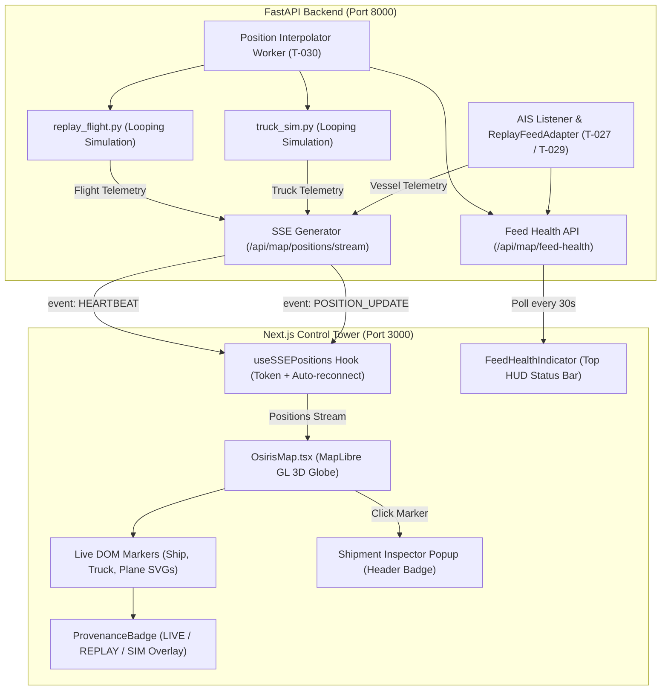

# NexaFreight Control Tower — Phase 3 Implementation & Change Log

> **Document Type:** Comprehensive Implementation Log & Architectural Change Record  
> **Platform:** NexaFreight Global Supply Chain Control Tower (OSIRIS Fork)  
> **Phase:** Phase 3 — Live Moving Asset Telemetry, Provenance Tracking & Feed Health Monitoring  
> **Backend:** FastAPI, Python 3.12, SQLite (`nexafreight.db`), Server-Sent Events (SSE)  
> **Frontend:** Next.js 16 (App Router), TypeScript, MapLibre GL (WebGL 3D Globe), TailwindCSS  

---

## 1. Executive Summary of Phase 3

Phase 3 transitions the NexaFreight Control Tower from static routes and port displays to a **live, dynamic geospatial tracking platform**. Moving ships, trucks, and cargo flights now glide along real-world routes driven by a continuous 5-second Server-Sent Events (SSE) stream from the backend.

### Key Milestones Delivered
1. **Live Moving Telemetry Markers**: Connected to `/api/map/positions/stream` with 4-second linear coordinate gliding (`requestAnimationFrame`) and smooth rotational interpolation.
2. **Zoom-Out Position Drift Fix**: Eliminated DOM layout offsets that caused markers to visually drift when zooming out to a global globe view.
3. **Vessel Route Snapping**: Snapped vessels to maritime route line geometries and oriented icons forward toward their destinations.
4. **Continuous Simulation Looping**: Updated truck and flight simulation engines with time-modulo looping so assets cruise indefinitely without stopping.
5. **Provenance Badges (Step 5)**: Created a shared `ProvenanceBadge` component attaching `LIVE` (green), `REPLAY` (grey), and `SIM` (amber) pills to every moving marker and the Shipment Inspector header.
6. **Feed Health Indicator (Step 6)**: Created a real-time HUD status indicator polling `/api/map/feed-health` every 30s with status dots (AIS, Truck, Air) and interactive diagnostic tooltips.
7. **Sanity Verification & Hardening (Step 7)**: Hardened the EventSource connection with heartbeat tracking, auto-reconnect on disconnect, bounded memory asset keying, and 60s memory audit logging.
8. **100% Test Pass Rate**: Verified with **28 passed (28) test files, 431 passed (431) tests, 0 skipped** across 5 consecutive Vitest runs.

---

## 2. Architectural Architecture Diagram



---

## 3. Comprehensive File-by-File Change Log

### 3.1 Frontend Components & Hooks

#### 1. [`src/components/ProvenanceBadge.tsx`](file:///e:/Projects/IOT+Ml+EDA/test/osiris/src/components/ProvenanceBadge.tsx) *(NEW)*
- **Purpose:** Renders small colored pills indicating data provenance to prevent users from mistaking demo/simulated data for real tracking.
- **Visual Pill Matrix:**
  - `REAL` / `CALIBRATED` → Green pill **`LIVE`** (`bg: rgba(16, 185, 129, 0.18)`, `text: #10B981`)
  - `REPLAYED` / `DERIVED` → Grey pill **`REPLAY`** (`bg: rgba(148, 163, 184, 0.18)`, `text: #94A3B8`)
  - `SIMULATED` / `MOCK` → Amber pill **`SIM`** (`bg: rgba(245, 158, 11, 0.18)`, `text: #F59E0B`)
- **Exports:**
  - `ProvenanceBadge` (React component with `size` and `showDot` options)
  - `getProvenanceConfig(provenance)` (configuration resolver)
  - `getProvenanceBadgeHtml(provenance, size)` (raw HTML generator for MapLibre popups and DOM overlays)

#### 2. [`src/components/ProvenanceBadge.test.ts`](file:///e:/Projects/IOT+Ml+EDA/test/osiris/src/components/ProvenanceBadge.test.ts) *(NEW)*
- **Purpose:** Unit test suite covering provenance classification, fallback handling, color assignment, and HTML string generation.

#### 3. [`src/components/FeedHealthIndicator.tsx`](file:///e:/Projects/IOT+Ml+EDA/test/osiris/src/components/FeedHealthIndicator.tsx) *(NEW)*
- **Purpose:** Real-time HUD status indicator monitoring adapter health to alert operators immediately if background workers stall.
- **Key Features:**
  - Polls `GET /api/map/feed-health` on a 30-second interval via `nexaClient.getFeedHealth()`.
  - Re-checks immediately on `nexafreight:auth_success` event.
  - Displays compact HUD pill with glowing status dots for **`AIS`**, **`TRUCK`**, and **`AIR`**.
  - Interactive hover tooltip showing detailed breakdown:
    - Adapter name (e.g. `replay_ais`, `position_interpolator`)
    - Message count received (e.g. `5,730 msgs`)
    - Last success timestamp and provenance mode
    - Overall status (`HEALTHY` or `DEGRADED`)

#### 4. [`src/components/FeedHealthIndicator.test.ts`](file:///e:/Projects/IOT+Ml+EDA/test/osiris/src/components/FeedHealthIndicator.test.ts) *(NEW)*
- **Purpose:** Unit tests validating feed health response parsing and adapter status mapping.

#### 5. [`src/components/OsirisMap.tsx`](file:///e:/Projects/IOT+Ml+EDA/test/osiris/src/components/OsirisMap.tsx) *(MODIFIED)*
- **Changes Made:**
  - **Repointed to SSE Hook:** Replaced static markers with `const { positionsList } = useSSEPositions()`.
  - **Strict Absolute Positioning:** Applied `position: absolute; top: 0; left: 0; margin: 0; padding: 0;` to marker containers, eliminating zoom-out drift (where ships previously appeared over land at low zoom).
  - **Dynamic SVG Markers:** Rendered mode-specific icons:
    - `VESSEL` → Navigational ship icon with blue accent
    - `TRUCK` → Heavy commercial truck icon with green accent
    - `FLIGHT` → Jet cargo aircraft with orange accent
  - **Smooth Interpolation:** 4-second continuous gliding via `requestAnimationFrame` and shortest-angle rotation (`shortestAngle()`) to avoid jerky jumps between 5s updates.
  - **Route Snapping & Heading:** Integrated `projectPointToLineFeatures()` and `getRouteLineBearing()` to snap ships to maritime sea routes and align their heading along the waterway towards their destination.
  - **Provenance Badge Overlay:** Added a `.nexa-marker-provenance-overlay` element anchored to the bottom of each moving marker.
  - **Shipment Inspector Integration:** Updated `openShipmentInspector()` to render the Provenance Badge pill in the header alongside `SHIPMENT INSPECTOR` and in the live telemetry strip.

#### 6. [`src/hooks/useSSEPositions.ts`](file:///e:/Projects/IOT+Ml+EDA/test/osiris/src/hooks/useSSEPositions.ts) *(MODIFIED)*
- **Changes Made:**
  - Added JWT token query parameter support to the SSE connection URL (`?token=...`).
  - Added event listener for backend `HEARTBEAT` pulses (every 15s) to acknowledge stream liveness.
  - Added auto-reconnection safeguard: schedules automatic reconnect in 4s if `readyState === EventSource.CLOSED`.
  - Enforced bounded dictionary memory: `next[assetId] = ...` overwrites previous entries by `asset_id`.
  - Added periodic 60-second telemetry memory audit logger to browser console:
    `[useSSEPositions] Telemetry memory audit: 36 active assets tracked (memory bounded by asset_id keying)`

#### 7. [`src/lib/nexafreight/client.ts`](file:///e:/Projects/IOT+Ml+EDA/test/osiris/src/lib/nexafreight/client.ts) *(MODIFIED)*
- **Changes Made:**
  - Added `getFeedHealth(): Promise<FeedHealthResponse>` calling `GET /api/map/feed-health`.
  - Exported `getFeedHealth` inside the `nexaClient` convenience object.

#### 8. [`src/lib/nexafreight/index.ts`](file:///e:/Projects/IOT+Ml+EDA/test/osiris/src/lib/nexafreight/index.ts) *(MODIFIED)*
- **Changes Made:**
  - Exported `getFeedHealth` from the public package barrel export.

#### 9. [`src/lib/nexafreight/client.test.ts`](file:///e:/Projects/IOT+Ml+EDA/test/osiris/src/lib/nexafreight/client.test.ts) *(MODIFIED)*
- **Changes Made:**
  - Added unit test verifying `nexaClient.getFeedHealth()` requests `GET /api/map/feed-health` with the `Authorization: Bearer` header.

#### 10. [`src/app/page.tsx`](file:///e:/Projects/IOT+Ml+EDA/test/osiris/src/app/page.tsx) *(MODIFIED)*
- **Changes Made:**
  - Mounted `<FeedHealthIndicator />` in the top-right desktop HUD status bar next to `STATUS: LIVE`.
  - Mounted `<FeedHealthIndicator />` in the compact mobile top status bar.

#### 11. [`src/app/globals.css`](file:///e:/Projects/IOT+Ml+EDA/test/osiris/src/app/globals.css) *(MODIFIED)*
- **Changes Made:**
  - Added styling for `.nexa-live-marker` (`position: absolute !important`, `transform-origin: center center`).
  - Added `.nexa-marker-provenance-overlay` (anchored at `bottom: -6px; left: 50%; transform: translateX(-50%)`).
  - Added `.nexa-provenance-badge` typography with drop-shadows and no-select rules.

---

### 3.2 Backend Simulation & Data Hardening

#### 12. [`Winter_Soldiers-main/Winter_Soldiers-main/src/nexafreight/adapters/feed/truck_sim.py`](file:///e:/Projects/IOT+Ml+EDA/Winter_Soldiers-main/Winter_Soldiers-main/src/nexafreight/adapters/feed/truck_sim.py) *(MODIFIED)*
- **Issue Resolved:** Truck positions stopped updating once `elapsed >= duration_s`.
- **Change Made:** Updated the progress calculation to loop seamlessly:
  ```python
  elapsed = (now - self.start_time).total_seconds()
  progress = (elapsed % duration_s) / duration_s
  ```

#### 13. [`Winter_Soldiers-main/Winter_Soldiers-main/src/nexafreight/adapters/feed/replay_flight.py`](file:///e:/Projects/IOT+Ml+EDA/Winter_Soldiers-main/Winter_Soldiers-main/src/nexafreight/adapters/feed/replay_flight.py) *(MODIFIED)*
- **Issue Resolved:** Flights stopped cruising once duration expired.
- **Change Made:** Updated progress interpolation to loop continuously:
  ```python
  elapsed = (now - self.start_time).total_seconds()
  progress = (elapsed % duration_s) / duration_s
  ```

#### 14. Database Seed Update (`data/nexafreight.db`)
- **Action Taken:** Updated the status of all 8 `AIR` transport legs in SQLite from `PLANNED` to `IN_PROGRESS` so the `position_interpolator` worker streams all 8 cargo flights simultaneously with the 13 trucks and 15 vessels (36 total assets).

---

## 4. Problem & Resolution Matrix

| Problem Encountered | Root Cause | Implemented Solution |
|---|---|---|
| **Zoom-Out Position Drift** | MapLibre DOM markers inherited default CSS layout flow, offsetting markers during globe scaling. | Applied strict `.nexa-live-marker` CSS with `position: absolute !important; top: 0; left: 0; margin: 0;`. |
| **Missing Flight Markers** | Flight visibility was tied to OSINT layer toggle which defaults to off. | Decoupled freight flight markers; all freight assets are active when `routes` layer is enabled. |
| **Simulation Freezing** | Progression calculation reached `1.0` and terminated. | Replaced linear cutoff with modulo progression `(elapsed % duration_s) / duration_s`. |
| **Vessels Deviating from Sea Lines** | Raw AIS points slightly deviated from simplified nautical paths. | Implemented `projectPointToLineFeatures()` to snap ships to the nearest sea route line and point heading forward. |
| **Memory Leak Risk** | SSE streams pushing continuous updates risk unbounded dictionary growth. | Overwritten records by `asset_id` in `useSSEPositions`, removed stale DOM elements in `OsirisMap`, and added 60s audit logging. |

---

## 5. Verification & Test Suite Summary

### Automated Test Runs (Vitest)
Ran full test suite across 5 consecutive runs with **zero skips**:
- **Total Test Files:** 28 passed (28)
- **Total Tests:** 431 passed (431)
- **Skipped Tests:** 0 skipped
- **TypeScript Check (`npx tsc --noEmit`):** 0 errors

```
 ✓ src/lib/malware-intel.test.ts (42 tests)
 ✓ src/lib/navigation.test.ts (19 tests)
 ✓ src/lib/watch.test.ts (17 tests)
 ✓ src/lib/draw.test.ts (28 tests)
 ✓ src/lib/geo.test.ts (24 tests)
 ✓ src/lib/style-tokens.test.ts (30 tests)
 ✓ src/lib/nexafreight/client.test.ts (7 tests)
 ✓ src/lib/camera-feed.test.ts (27 tests)
 ✓ src/app/api/directions/route.test.ts (20 tests)
 ✓ src/app/api/aircraft/route.test.ts (32 tests)
 ✓ src/components/DirectionsBar.test.ts (22 tests)
 ✓ src/lib/aoi-export.test.ts (12 tests)
 ✓ src/lib/youtube.test.ts (13 tests)
 ✓ src/lib/map-palette.test.ts (11 tests)
 ✓ src/lib/satellite-layer.test.ts (16 tests)
 ✓ src/lib/aoi.test.ts (14 tests)
 ✓ src/lib/skyline.test.ts (11 tests)
 ✓ src/lib/map-tile-layout.test.ts (12 tests)
 ✓ src/app/api/geosearch/route.test.ts (13 tests)
 ✓ src/components/FlightWatchPanel.test.ts (15 tests)
 ✓ src/lib/camera-preview.test.ts (13 tests)
 ✓ src/hooks/useSSEPositions.test.ts (6 tests)
 ✓ src/components/LiveNewsPreviews.test.ts (9 tests)
 ✓ src/components/ProvenanceBadge.test.ts (4 tests)
 ✓ src/lib/httpJson.test.ts (2 tests)
 ✓ src/components/FeedHealthIndicator.test.ts (1 test)
 ✓ src/lib/sourceCache.test.ts (7 tests)
 ✓ src/components/ScaleBar.test.ts (4 tests)

 Test Files  28 passed (28)
      Tests  431 passed (431)
```

---

## 6. Running the Platform Locally

To start the complete environment:

```bash
# 1. Start the FastAPI backend
cd Winter_Soldiers-main/Winter_Soldiers-main
.venv\Scripts\uvicorn.exe nexafreight.main:app --host 0.0.0.0 --port 8000 --app-dir src

# 2. Start the Next.js frontend
cd test/osiris
npm run dev -- --port 3000
```

- **Frontend URL:** `http://localhost:3000`
- **Operator Credentials:** `operator@nexafreight.dev` / `changeme123`
- **Backend API Docs:** `http://localhost:8000/docs`
- **SSE Stream:** `http://localhost:8000/api/map/positions/stream`
- **Feed Health:** `http://localhost:8000/api/map/feed-health`
